# Sonny — Project Alfred Robotic Butler

<p align="center">
  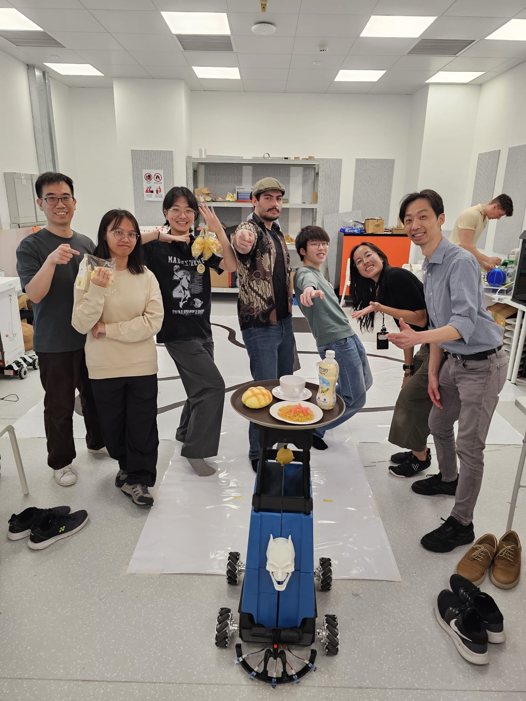
</p>

> Sonny is a mecanum-wheeled robotic butler built for HKU School of Innovation **INTC1002 / Project Alfred (Minilab 6)**.
> He follows floor tracks, navigates to ArUco markers, dodges obstacles, listens for voice commands, recognises hand gestures, and holds a conversation — all powered by a Raspberry Pi 5 and an ESP32-S3 talking over UART.

<p align="center">
  <b>Demo:</b> April 24, 2026 &nbsp;•&nbsp;
  <b>Course:</b> HKU INTC1002 &nbsp;•&nbsp;
  <b>Wake phrase:</b> <i>"Hello Sonny"</i>
</p>

📄 **Full technical writeup:** [Sonny — Technical Report (PDF)](docs/Sonny_Technical_Report.pdf)

---

## Highlights

| | |
|:---:|:---|
| 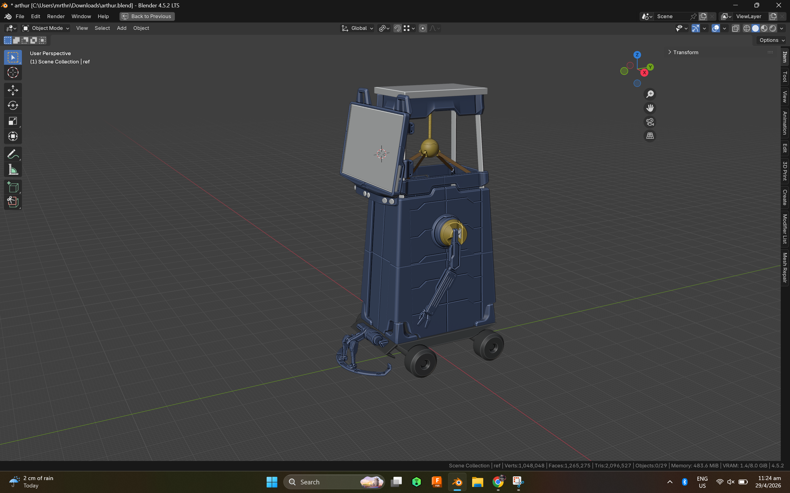 | **Custom industrial design** — body modelled in Fusion 360 for tolerances, then imported into Blender for fast iteration on the head, screen mount, and skirt. Final form factor optimised for the 14″ portrait monitor and a forward-facing camera. |
| 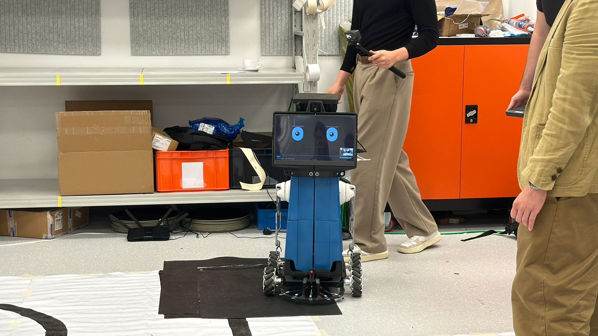 | **Animated 14″ face** — pygame-rendered eyes with 8 emotions (happy / curious / focused / sad / surprised / angry / sleepy / dance), live status bar, current intent, and a corner camera PiP with ArUco overlay. |
| 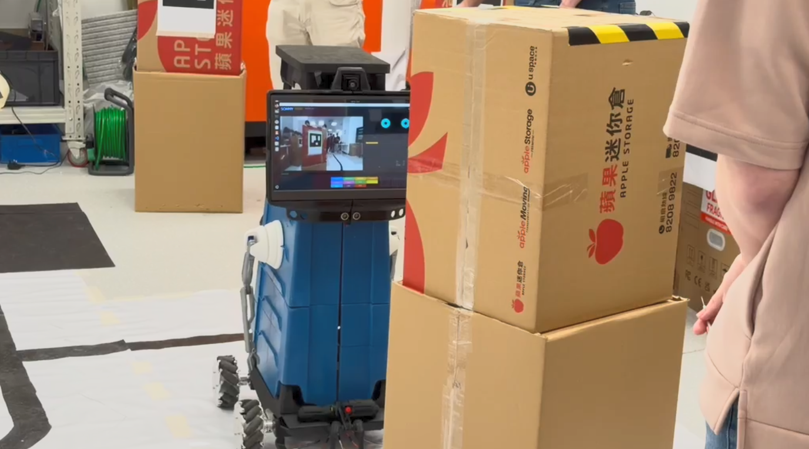 | **ArUco marker approach** — pinhole-model distance estimate from an 18 cm DICT_4X4_50 tag. Robot drives to a 30 cm stop target, holds in a 25–38 cm band, and only declares arrival after **3 s** of in-band, centred frames. |
| 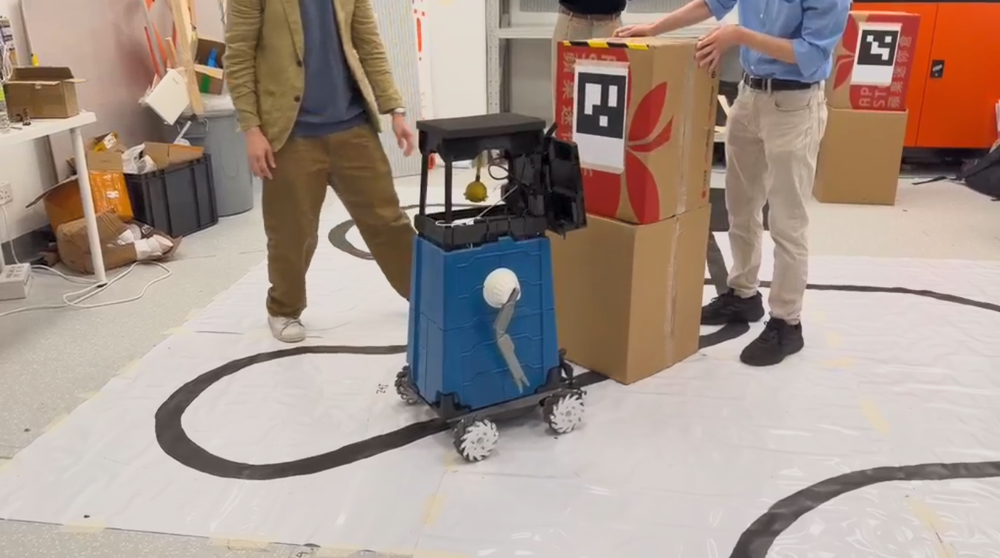 | **Line follower with obstacle gate** — 5× TCRT5000 IRs feed a weighted controller; a forward HC-SR04 stops the robot when something walks in, and resumes once the path is clear. |
| 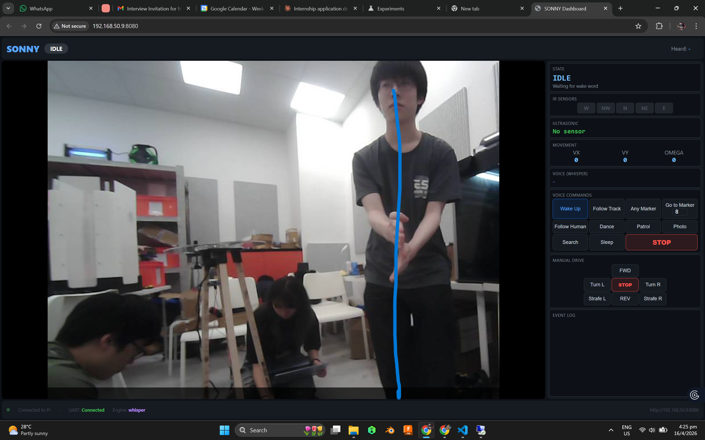 | **Web dashboard** — Flask app on the Pi exposes the camera MJPEG stream, sensor read-outs, keyboard drive, and a hold-to-talk phone microphone relay. Reachable from any device on the same network. |
| 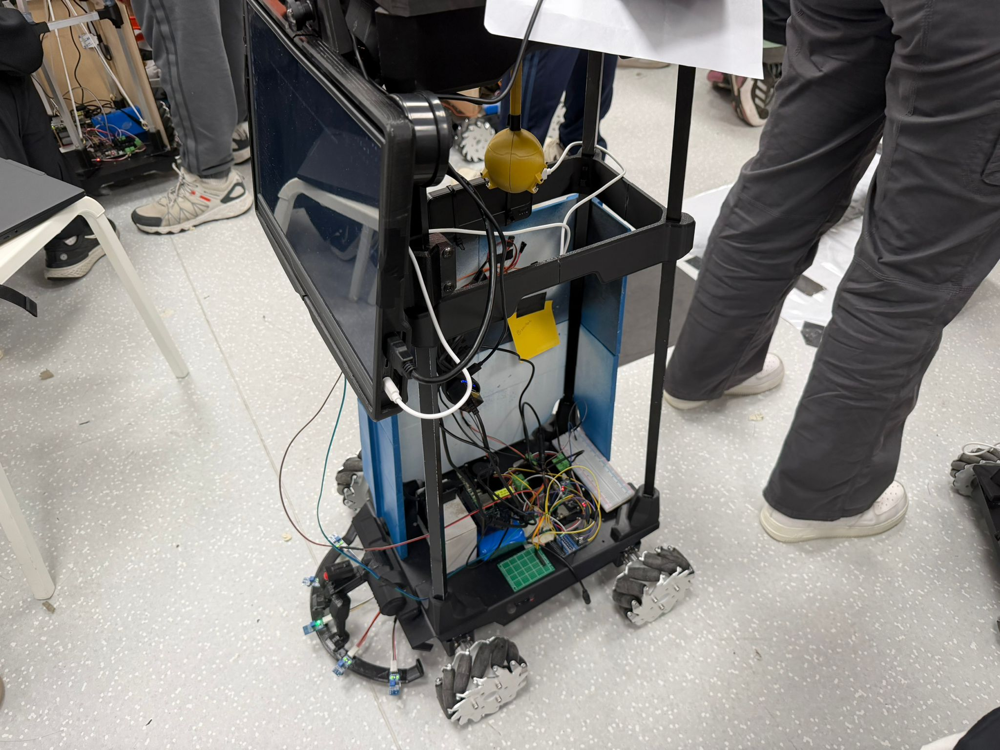 | **Real wiring** — Pi 5 ↔ ESP32-S3 over UART (115200 baud, `/dev/ttyAMA2`), bidirectional level shifter for the HC-SR04, LM2596 buck for servo rail. Full pin map in [`docs/WIRING.md`](docs/WIRING.md). |

---

## Architecture

Sonny uses a **split-brain design** to keep real-time motor control off the high-level decision loop:

| Component | Role |
|-----------|------|
| **Raspberry Pi 5** | Decision engine. Python FSM, computer vision, voice pipeline, expression engine, GUI, web dashboard. |
| **ESP32-S3** | Motor PWM, 5× IR line sensor reads at 20 Hz, HC-SR04 ultrasonic at 10 Hz, buzzer. PlatformIO firmware in [`esp32/src/main.cpp`](esp32/src/main.cpp). |
| **14″ USB-C monitor** | Sole on-robot display — runs the demo face GUI in fullscreen Pygame. |

**UART protocol** — Pi sends `mv_vector:vx,vy,omega\n`; ESP32 streams `IR_STATUS:XX\n` and `DIST_C:XX.X\n` back.

**Mecanum inverse kinematics:**
`FL = vx + vy + omega`, `FR = vx − vy − omega`, `RL = vx − vy + omega`, `RR = vx + vy − omega`

A full system architecture diagram is in [`docs/showcase/wiring_diagram.svg`](docs/showcase/wiring_diagram.svg).

---

## Capability matrix (Project Alfred requirements)

| Req | Description | Status |
|-----|-------------|--------|
| **R1** | Voice commands — wake phrase + natural-language intent | ✅ OpenAI Realtime API + GPT-4o-mini intent classifier |
| **R2** | Line-following delivery (5× IR weighted control) | ✅ Working with obstacle gate |
| **R3** | ArUco marker approach (markers 1–50) | ✅ 18 cm tag, 30 cm stop, 3 s arrival debounce |
| **R4** | Obstacle detection (HC-SR04 + YOLO + camera reroute) | ✅ Hybrid: ultrasonic stop + camera-based reroute |
| **R5** | Intention indicators (TTS, buzzer, eyes, face GUI, arm gestures) | ✅ |
| **EC1** | Gesture recognition (MediaPipe — 6 gestures) | ✅ |
| **EC2** | Autonomous rerouting (potential field + side-choice) | ✅ |
| **EC3** | LLM butler conversation | ✅ OpenAI GPT-4o-mini |
| **EC4** | Autonomous patrol (wander + person detect + gestures) | ✅ |
| **EC5** | Butler personality (8 emotions, head tracking, arm waves) | ✅ |

---

## Hardware

### Provided by HKU
- Raspberry Pi 5 + 5 V/5 A PSU + 64 GB SD + mobile battery pack
- ESP32-S3 mecanum platform + 12 V battery pack
- USB camera, USB microphone, USB speaker, F-F UART wires

### Purchased
- 14″ USB-C portable monitor + 20000 mAh PD power bank + USB-C PD cable
- Micro-HDMI to HDMI cable (Pi 5 → monitor)
- 4× SG90 servos + brackets (head tilt + 2-DOF arms × 2)
- LM2596 buck converter (12 V → 5 V/3 A for servo rail)
- HC-SR04 ultrasonic + bidirectional level shifter
- USB WiFi adapter (RTL8811AU + external antenna), powered USB 3.0 hub
- M2/M2.5/M3 hardware kit

### On-robot peripherals
- **PCA9685** servo controller — head tilt (ch0), left arm (ch1–2), right arm (ch3–4)
- **5× TCRT5000** IR line sensors — GPIO 5, 6, 7, 15, 45
- **HC-SR04** centre ultrasonic — TRIG = GPIO 8, ECHO = GPIO 9 (level-shifted)
- **Piezo buzzer** — GPIO 46

---

## Build log

A few snapshots from the design iterations that didn't make the final robot:

| | |
|:---:|:---:|
| 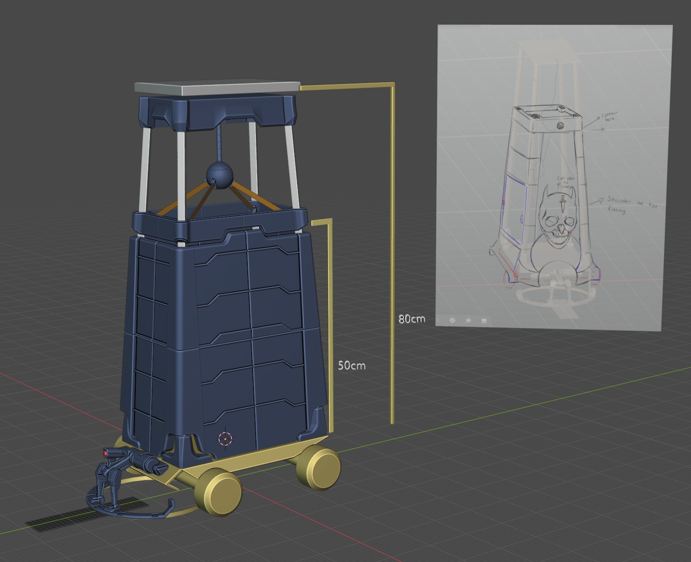<br><sub>Initial concept sketch with target dimensions — no arms in the first pass.</sub> | 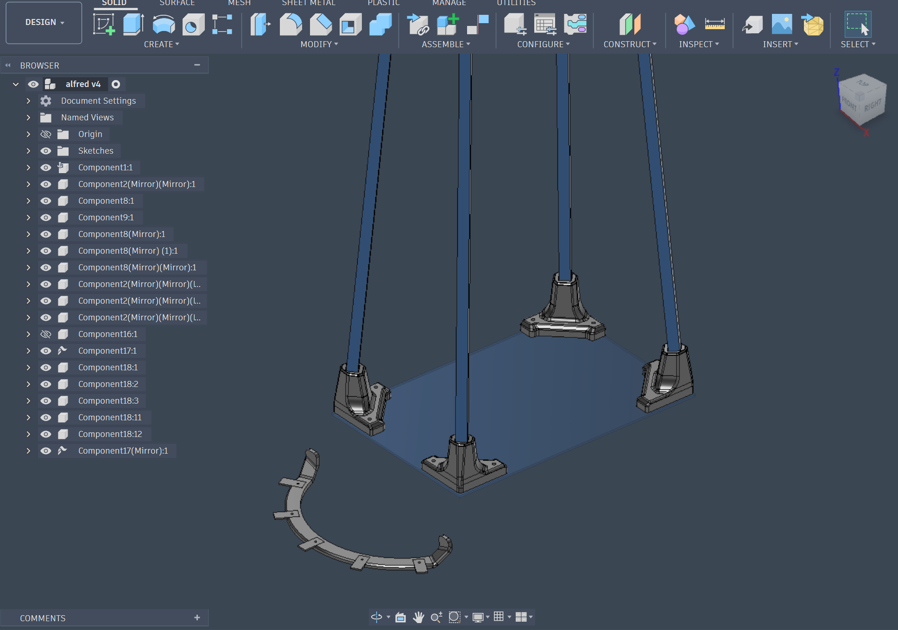<br><sub>Base modelled in Fusion 360 for tolerances, then exported to Blender for faster sculpting.</sub> |
| 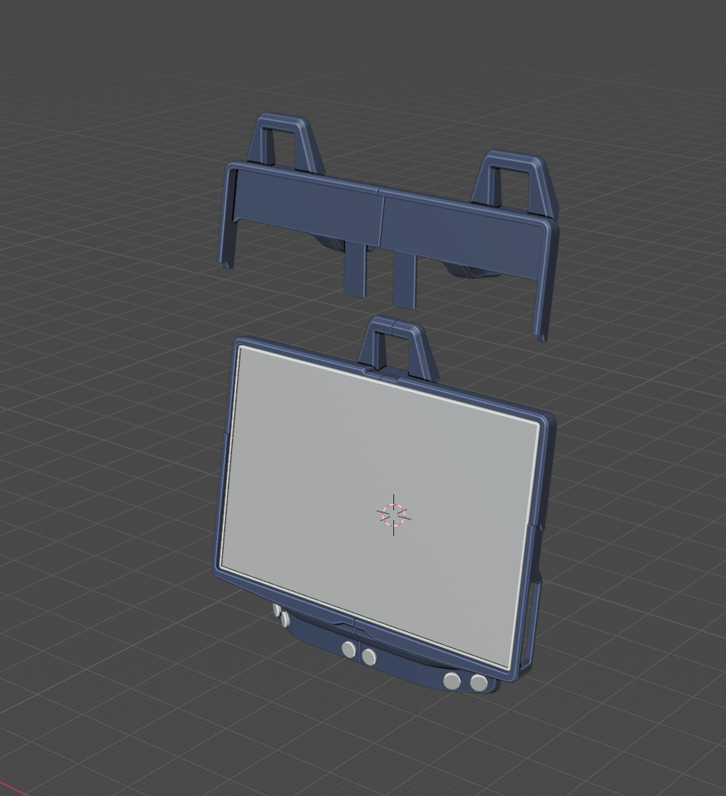<br><sub>Screen-holder concepts — single vs. dual camera mount.</sub> | 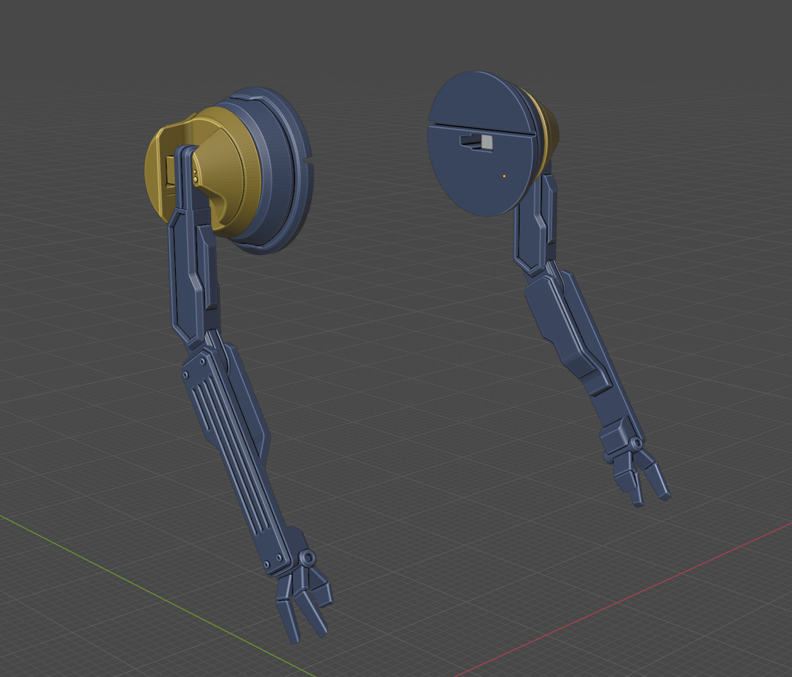<br><sub>Earlier arm design — dropped due to GPIO + servo voltage budget. Replaced with PCA9685-driven SG90s.</sub> |
| 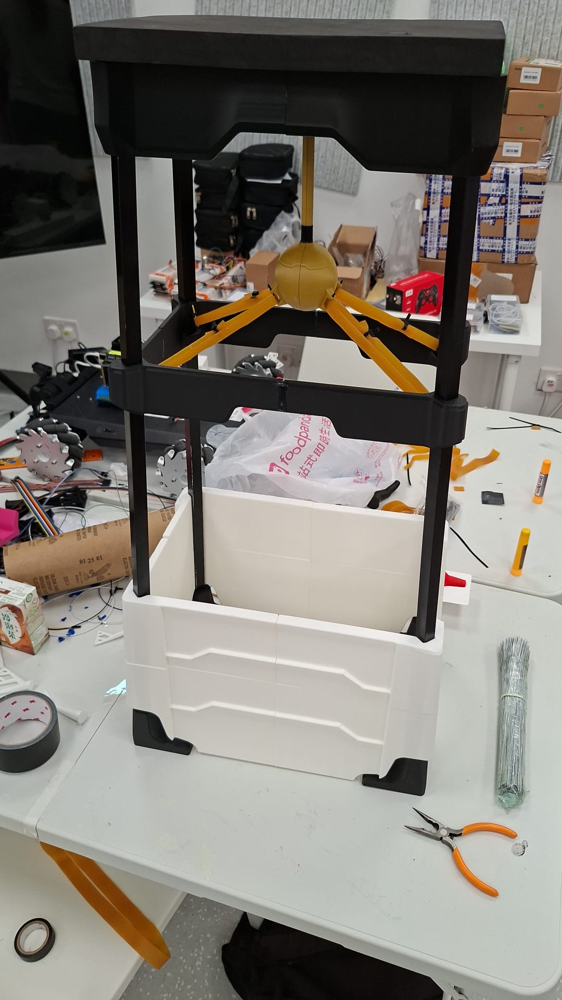<br><sub>Pendulum mass-dampening test rig.</sub> | 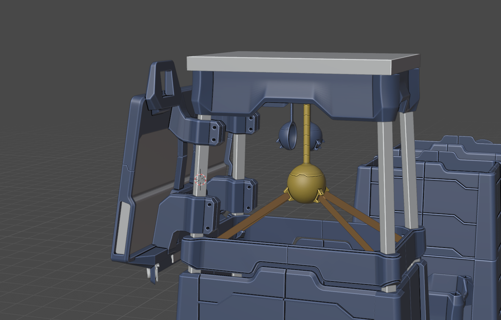<br><sub>Final pendulum-based mass-dampening system used to keep the camera steady at speed.</sub> |
| 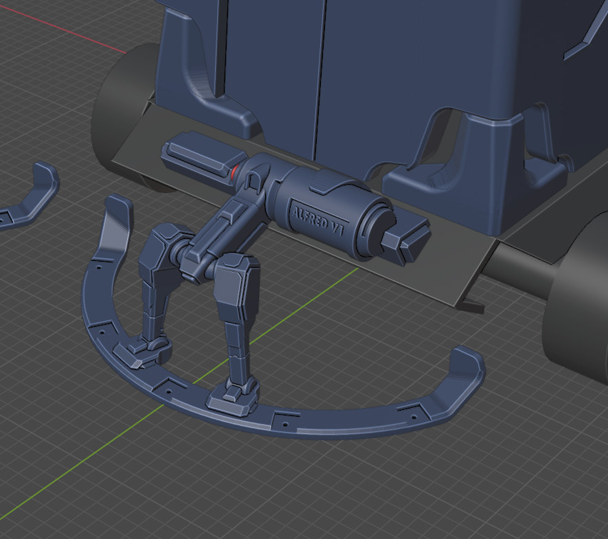<br><sub>IR sensor underside mount, line-follower array.</sub> | |

---

## Software setup

### Prerequisites
- Raspberry Pi OS (64-bit) on Pi 5
- Python 3.11+
- PlatformIO (for ESP32 firmware, built from a Windows / Mac / Linux dev box)

### Quick setup on the Pi

```bash
git clone https://github.com/Murathanx12/AR-2.git
cd AR-2
bash setup_pi.sh
```

Installs system packages (espeak-ng, portaudio, i2c-tools), creates a venv, installs `requirements.txt`.

### API keys (`.env` at repo root)

```
OPENAI_API_KEY=sk-...     # Realtime STT, GPT-4o-mini intent + butler chat, vision
```

VPN to a Singapore endpoint is required if you're running this in HK / mainland China:

```bash
sudo openvpn --config /etc/openvpn/windscribe.conf --daemon
curl -s https://ipinfo.io/country   # should print SG
```

### ESP32 firmware

```bash
cd esp32
pio run --target upload
```

---

## Run it

```bash
source .venv/bin/activate

# Demo face on the 14" monitor (what you saw on demo day)
python3 Minilab5/alfred.py --demo --fullscreen

# Debug GUI windowed (camera feed + sensors + event log)
python3 Minilab5/alfred.py

# Headless / SSH
python3 Minilab5/alfred.py --headless

# Skip a subsystem
python3 Minilab5/alfred.py --no-voice
python3 Minilab5/alfred.py --no-camera

# Per-tool diagnostics
python3 scripts/test_esp32.py
python3 scripts/test_aruco.py
python3 scripts/test_whisper.py
```

---

## Voice commands

Say **"Hello Sonny"** once — the robot stays awake until you say "sleep". `stop` always works regardless of state.

| Command | Behaviour |
|---------|-----------|
| `follow the track` | Line-following delivery (R2) |
| `go to marker 5` *(any number 1–50)* | ArUco marker approach (R3) |
| `come here` / `follow me` | Person approach via MediaPipe |
| `patrol` / `wander` | Autonomous patrol with gesture recognition |
| `take a photo` | Capture + save to `photos/`, view at `/photos` on the web dashboard |
| `dance` | 5-second routine with the arm servos |
| `chat` / `tell me` | Free-form conversation via GPT-4o-mini |
| `stop` | Emergency stop |
| `sleep` | Back to wake-word gating |

Unknown utterances auto-route to the LLM butler chat. Low-confidence intents ask "Did you mean X?" before acting.

---

## Repo layout

```
alfred/                     Python package (runs on Pi)
  config.py                 All tunables as frozen dataclasses
  comms/                    UART protocol + thread-safe bridge
  navigation/               line follower, ArUco approach, obstacle avoider, patrol
  vision/                   camera, ArUco, YOLO, MediaPipe person/gesture, GPT-4o vision
  voice/                    OpenAI Realtime listener, intent, TTS, butler conversation
  expression/               eyes, head, arms, personality engine
  fsm/                      17-state IntEnum + 30 Hz controller
  gui/                      debug dashboard + fullscreen demo face
  web/                      Flask dashboard, phone-mic relay, photo gallery
  utils/                    logging, timing helpers
Minilab5/alfred.py          Entry point
esp32/src/main.cpp          ESP32-S3 firmware (PlatformIO)
docs/
  Sonny_Technical_Report.pdf   Full writeup
  WIRING.md                    Pin map
  ARCHITECTURE.md              Architecture notes
  showcase/                    Photos, design renders, diagrams
scripts/                    Subsystem diagnostics + helpers
tests/                      pytest suite
setup_pi.sh                 Automated Pi setup
requirements.txt
```

---

## Troubleshooting

**ESP32 motors don't move** — UART connects but motors silent. Run `python3 scripts/test_esp32.py`. Check the 12 V battery and motor-driver wiring.

**Voice misses commands** — the Pi USB mic is the primary input; phone mic via `/audio` is a backup. Stay within ~30 cm of the USB mic, or use the hold-to-talk button on the dashboard.

**Camera not detected** — `ls /dev/video*`; plug directly into the Pi (not the powered hub). Run `python3 Minilab5/alfred.py --no-camera` to bypass.

**UART silent** — verify Pi-TX→ESP-RX, Pi-RX→ESP-TX, common GND. Confirm `/dev/ttyAMA2` exists and UART is enabled in `raspi-config`.

**No TTS audio** — `sudo apt install espeak-ng mbrola mbrola-us1`; make sure the USB speaker is the default ALSA output.

---

## License & credits

Built by the HKU INTC1002 Project Alfred team for course coursework. Hardware platform provided by HKU; software, mechanical design, and integration are original work.

For the full engineering writeup — design decisions, control theory, calibration, failure modes — see [`docs/Sonny_Technical_Report.pdf`](docs/Sonny_Technical_Report.pdf).
